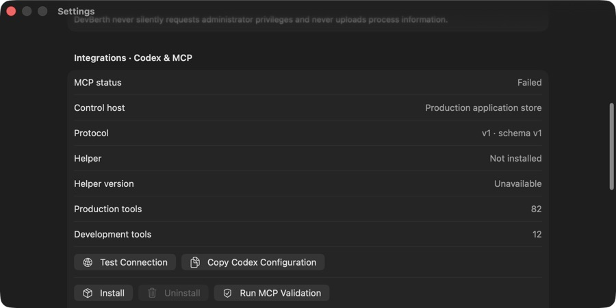

# DevBerth MCP overview



DevBerth exposes its complete local development-runtime control plane to Codex and compatible MCP clients. Production provides 82 tools, 11 resources/templates, and 9 prompts; an isolated Debug development host adds 12 tools and one prompt.

## Versions and compatibility

| Component | Version |
| --- | --- |
| MCP protocol | `2025-11-25` |
| Official Swift SDK | `modelcontextprotocol/swift-sdk` `0.12.1` |
| MCP executable | `devberth-mcp` |
| Control IPC protocol | `1` |
| Tool schema | `1` |
| Persistence schema | SwiftData V7 |
| Helper language mode | Swift 6 |
| Application deployment | macOS 14+, Xcode 16.4 baseline |
| Validation environment | Xcode 26.4, Apple Swift 6.3 |

Production uses MCP over STDIO. Streamable HTTP is deliberately excluded: Codex and the SDK support it, but a network listener adds authentication and exposure without helping a same-user native app.

## Architecture

```text
Codex or MCP client
        │ MCP 2025-11-25 over STDIO
        ▼
devberth-mcp
        │ bounded current-UID Unix socket
        ▼
DevBerth ApplicationControlPlane
        │
        ├── one PortMonitor and runtime snapshot
        ├── existing ownership/lifecycle/project/session/Docker services
        ├── one SwiftData V7 ModelContainer
        ├── Keychain reference broker
        └── bounded redacted logs and audit history
```

The helper is not a second application. It does not run `lsof`, `ps`, Docker, Homebrew, `launchctl`, a shell, SwiftData, or Keychain. It adapts MCP schemas/annotations to the app-owned control host. If the production host is absent, it asks Launch Services to open DevBerth without activating it, retries for five seconds, and returns `host_unavailable` if no host appears.

## Installation

In DevBerth, open **Settings → Integrations → Codex & MCP**:

1. Select **Install/Repair Helper**.
2. Choose global `~/.codex/config.toml` or a project root for `.codex/config.toml`.
3. Preview the exact TOML change.
4. Apply it and use **Validate Connection**.
5. Restart Codex or reload MCP servers if the client was already running.

Stable helper path:

```text
~/Library/Application Support/DevBerth/bin/devberth-mcp
```

Manual fallback:

```bash
Scripts/install-mcp-helper
```

Codex table:

```toml
[mcp_servers.devberth]
command = "/Users/YOU/Library/Application Support/DevBerth/bin/devberth-mcp"
args = ["serve", "--stdio"]
startup_timeout_sec = 10
tool_timeout_sec = 120
```

The Settings editor accepts only a regular non-symlink configuration up to 1 MiB, rejects duplicate DevBerth tables, preserves unrelated content, writes atomically, verifies the result, and leaves a timestamped backup.

## Operating rules

- Inspect first and use stable IDs from current responses.
- Send the current `revision` with updates; stale changes return `entity_changed`.
- Use `operation_preview`, explain the exact targets/effects/risks, obtain approval, then call `operation_execute`.
- Use `change_set_preview` and `change_set_execute` for coordinated configuration changes.
- Never treat a PID, inference, label, or executable prefix as authority.
- Secret values must be entered through DevBerth's secure GUI. MCP accepts opaque references and returns configured/resolved state only.
- Results are structured and bounded. Continue with `next_cursor` when `truncated` is true.

See [MCP_TOOL_REFERENCE.md](MCP_TOOL_REFERENCE.md), [MCP_SECURITY.md](MCP_SECURITY.md), and [MCP_TROUBLESHOOTING.md](MCP_TROUBLESHOOTING.md).

## Explicit exclusions

- Arbitrary shell/command execution, SQL, raw Docker/Homebrew/launchd calls, and general file writes.
- Raw PID signaling or restart recipes inferred from observations.
- Secret values over MCP.
- Presentation-only Finder, Terminal, browser, window, quit, and app-activation commands.
- Production data reset and all development tools in Release.
- Production Streamable HTTP.

Kubernetes forwards, SSH tunnels, Homebrew services, launchd, containers, and Compose are inspectable. Mutation is offered only when the existing owner resolver supplies the exact supported controller context; otherwise DevBerth refuses.
