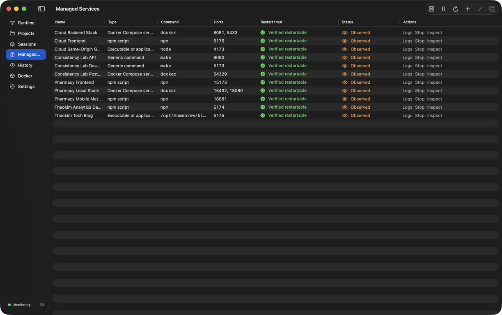
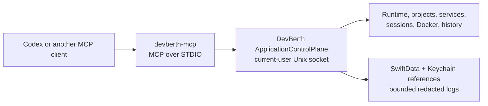
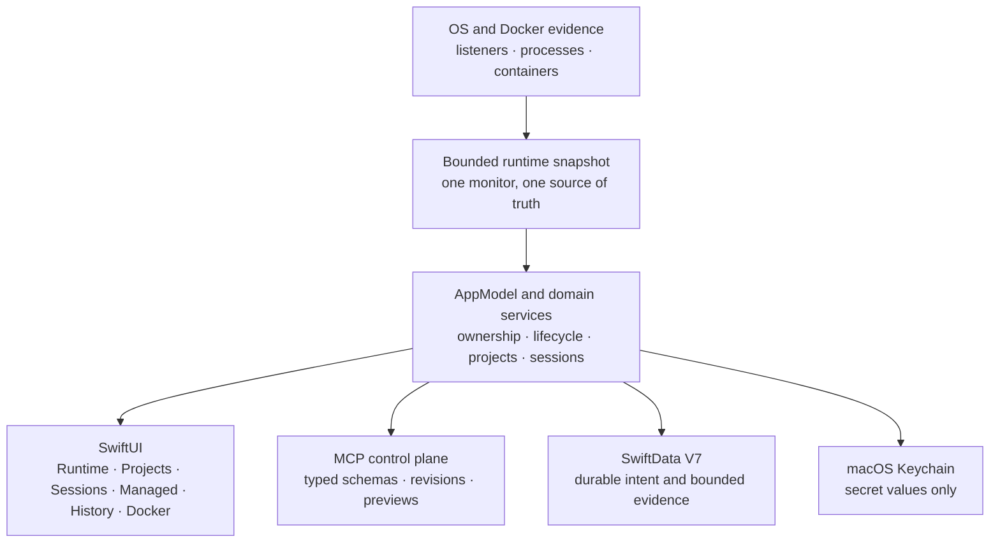

<p align="center">
  
</p>

<h1 align="center">DevBerth</h1>

<p align="center">
  <strong>Understand what is listening on your Mac. Control local development services without guessing.</strong>
</p>

<p align="center">
  A native macOS runtime explorer, guarded service controller, and local MCP control plane for development environments.
</p>

<p align="center">
  <a href="https://github.com/ysbc1247/portpilot-macos/actions/workflows/ci.yml"></a>
  
  
  
  <a href="LICENSE"></a>
</p>

<p align="center">
  <a href="#quick-start">Quick start</a> ·
  <a href="#product-tour">Product tour</a> ·
  <a href="#codex-and-mcp">Codex &amp; MCP</a> ·
  <a href="#architecture-and-safety">Architecture</a> ·
  <a href="#development">Development</a> ·
  <a href="Documentation/README.md">Documentation</a>
</p>



<p align="center"><sub>Managed Services shows the reviewed definition, expected ports, restart trust, live evidence, and independent controls for each service.</sub></p>

## What is DevBerth?

DevBerth explains the local runtime behind a development workspace. It combines macOS listener and process evidence, project definitions, managed services, Docker and Compose metadata, health checks, lifecycle history, and workspace sessions in one native SwiftUI app.

The central idea is simple: **seeing a process is not the same as having authority to control it**. DevBerth keeps observed operating-system evidence separate from user-reviewed service definitions. A listener can be inspected immediately, but reliable Start and Restart are available only after the exact service configuration has passed isolated validation. Destructive actions re-check the target immediately before mutation.

DevBerth is useful when you need to answer questions such as:

| Question | What DevBerth provides |
| --- | --- |
| What is using port 5173? | Listener, process, PID, executable, command, working directory, project inference, resources, and ownership evidence. |
| Why is this process running? | Bounded process lineage, runtime classification, Docker association, managed-service relationship, and confidence-labeled reasoning. |
| Can I stop only the frontend? | Independent per-service controls, exact-owner resolution, explicit confirmation for observed processes, and fresh safety checks. |
| Can I restart it later? | An explicit restart-trust state based on the exact reviewed and validated service definition. |
| In what order should this project start? | Dependency validation, startup layers, parallel independent starts, reverse-order stops, and visible operation progress. |
| What changed while I was away? | Searchable lifecycle events, health transitions, runtime instances, and deterministic incident summaries. |
| Can Codex use the same information safely? | A production MCP server that forwards typed requests to the running app's control plane instead of creating a second runtime authority. |

## Why DevBerth exists

Local development environments rarely consist of one process. A single workspace may include a frontend dev server, API, database, mobile bundler, reverse proxy, tunnel, background worker, and several Docker containers. Traditional port tools usually show isolated facts; process managers usually assume they launched everything themselves.

DevBerth connects those views while preserving their trust boundaries:

- **Runtime evidence** answers what the operating system currently shows.
- **Managed-service intent** records what the user reviewed and expects to run.
- **Ownership resolution** determines which process, container, Compose service, or app-managed process group may be controlled.
- **Restart trust** determines whether the exact current definition is safe to launch again.
- **Lifecycle evidence** records what was actually observed, not what a button hoped would happen.

That distinction prevents a matching port, familiar executable name, stale PID, or inferred project from silently becoming control authority.

## At a glance

| Area | Capabilities |
| --- | --- |
| Runtime discovery | TCP listeners, meaningful bound UDP endpoints, IPv4/IPv6, address scope, process identity, lineage, CPU, memory, project inference, and Docker association. |
| Managed services | Generic commands, executables, npm/pnpm/Yarn/Bun scripts, Gradle, Maven, custom shells, Docker containers, and verified Compose services. |
| Projects | Service membership, dependencies, expected ports, discovery adapters, manifests, ordered Start All, reverse Stop All, and per-service actions. |
| Sessions | Capture selected projects, compare drift, dry-run restore, dependency-layer execution, scoped rollback, and expected-stopped handling. |
| Health and history | Readiness, TCP/HTTP/command/file/Docker/dependency checks, health transitions, bounded logs, lifecycle search, and incident summaries. |
| Automation | 82 production MCP tools, resources, prompts, revision checks, destructive previews, change sets, progress, and structured results. |
| Privacy | Local-only data, Keychain-backed secrets, bounded redacted logs, no account, no telemetry, and no runtime-data upload service. |

## Product tour

DevBerth uses one stable sidebar hierarchy: **Runtime, Projects, Sessions, Managed Services, History, Docker, and Settings**. The main workspace shows the collection; a contextual inspector explains the selected item and the actions that are currently safe.

### Runtime: see what is actually listening


Runtime is the live operating-system view. It can be displayed as a sortable table or grouped by inferred project. Search covers ports, protocols, addresses, process names, commands, and projects. Saved views isolate managed, unexpected, unhealthy, Docker, and externally reachable listeners.

For each listener, DevBerth can show:

- protocol, address, port, address scope, and current listener state;
- process name, PID, owner, executable path, command, working directory, start time, and parent evidence;
- inferred runtime and project, with explicit confidence rather than a fabricated certainty;
- transient CPU and resident-memory usage from one bounded batched reader;
- Docker container, published-port, health, and Compose association when verified;
- restart trust, health, lifecycle evidence, logs, and safe actions.

Inspect and Stop sit beside the process so actions are visible. Root-owned and recognized system processes remain protected. An observed service Stop requires confirmation and succeeds only if fresh fingerprint, listener-edge, protected-process, and owner-context checks still match.

### Projects: operate a workspace, not a pile of ports

A project groups reviewed services and their dependency edges. DevBerth shows expected ports, current observed or controlled activity, Docker relationships, startup layers, incomplete dependencies, cycles, and recent failures.

- **Start All** launches only stopped, verified definitions while preserving the complete dependency graph.
- **Stop All** walks dependencies in reverse and reports visible per-service progress and results.
- **Start, Stop, and Inspect** remain available independently on every service row.
- **Discover Services** reads supported project files only inside a user-selected root and returns unreviewed candidates.
- **Export Manifest** writes a versioned `devberth-runtime.json` without secrets or Keychain reference identifiers.

Discovery supports JavaScript package managers, Gradle, Maven, Python, Go, Cargo, Docker Compose, Procfile, and Process Compose definitions. It is non-recursive, bounded, and never evaluates a project command during discovery.

### Managed Services: define what may be launched again

A Managed Service is durable, user-reviewed intent. It records the launch mechanism, command and arguments, working directory, expected ports, readiness and health checks, shutdown policy, restart policy, dependencies, log settings, and opaque Keychain references.

Start and Restart are gated by the exact configuration digest. Validation performs an isolated start, observes readiness and reviewed checks, and performs a controlled stop before the definition becomes **Verified restartable**. Editing a safety-relevant field invalidates that trust until the new definition passes validation.

Per-row operation state is independent: stopping one service cannot flip every other service's button. Progress, success, refusal, and failure remain visible until replaced by a newer operation.

### Sessions: capture and restore a development workspace

A Workspace Session records selected projects and their expected managed-service state—not arbitrary process objects or shell sessions. A restore always begins with a fresh preview.

The preview checks definitions, Keychain references, restart trust, expected ports, dependencies, directories, executables, and conflicts. Starts run in dependency layers. If a layer fails, DevBerth can roll back only services started by that restore; it never stops an unmanaged process or a service that was already running as compensation.

### History and health: understand what changed

DevBerth treats process-running, listener-open, service-ready, and service-healthy as separate facts. The History view indexes bounded lifecycle evidence for fast filtering by time, severity, source, event, service, summary, and result.

Evidence includes launches, stops, exits, readiness, health degradation and recovery, automatic-restart attempts, crash-loop limits, listener changes, Docker transitions, and restore results. Incident summaries are deterministic and built from ordered evidence rather than generated prose.

### Docker and Compose: inspect broadly, mutate narrowly

Docker is optional. Listener monitoring continues when Docker is absent or its daemon is stopped. When available, DevBerth parses structured container data, published ports, state, health, restart policy, and canonical Compose labels.

A Compose mutation is enabled only after DevBerth verifies the exact project name, project directory, configuration files, environment files, configuration hash, and container membership. One-off containers never gain service-level control, and DevBerth never falls back to signaling a container's host PID.

### Menu bar and command palette

The menu-bar surface shows active managed, unexpected, and unhealthy counts plus favorite services and recent projects. Press **⌘K** for a keyboard-first command palette that searches runtime items, projects, managed services, and sessions.

Both surfaces call the same application actions as the main window. They do not bypass ownership, validation, confirmation, or restart-trust rules.

## The control and trust model

| Runtime state | Inspect | Stop | Start or Restart |
| --- | :---: | :---: | :---: |
| Observed listener/process | Yes | Only after explicit confirmation and fresh exact-owner revalidation | No authority is inferred from observation |
| Live DevBerth-managed runtime | Yes | Yes, through its registered policy and revalidated process group | Only from the exact verified definition |
| Verified Docker/Compose owner | Yes | Only through the verified controller context | Only when the exact supported context remains valid |
| Protected or unverifiable process | Yes, with limitations shown | Refused | Refused |

Before signaling a host process, DevBerth compares a strong fingerprint containing PID, UID, executable path and file identity when available, start time, command digest, and parent PID. It also re-checks the exact listener-to-process edge. A changed or incomplete identity is a refusal, not a reason to weaken the check.

## Quick start

### Requirements

- macOS 14.0 or newer on Apple silicon;
- Xcode 16.4 or newer at `/Applications/Xcode.app`;
- Git;
- Docker Desktop or a compatible Docker CLI only if you want Docker features.

DevBerth is currently distributed from source. The repository does not yet publish a Developer ID-notarized binary or an automatic updater.

### Build and install the daily-use app

```bash
git clone https://github.com/ysbc1247/portpilot-macos.git
cd portpilot-macos
Scripts/build-and-install-app --open-full-disk-access
open /Applications/DevBerth.app
```

The installer:

1. builds the Release configuration;
2. verifies the signed bundle;
3. atomically replaces `/Applications/DevBerth.app`;
4. installs the matching MCP helper at `~/Library/Application Support/DevBerth/bin/devberth-mcp`;
5. optionally opens macOS Privacy & Security → Full Disk Access.

macOS does not provide an API for an app to grant itself Full Disk Access. Add or enable DevBerth manually in System Settings if you want the broadest same-user process metadata. DevBerth continues to work with reduced visibility when permission is not granted.

### First launch

The welcome guide explains the product's visibility and safety boundaries before directing you to one of four common starting points:

1. Review the current Runtime.
2. Import or create a Project.
3. Create and validate a Managed Service.
4. Capture a Workspace Session.

No account is required. DevBerth does not request administrator privileges or upload the observed runtime.

### Run from Xcode

Open `DevBerth.xcodeproj`, select the **DevBerth** scheme, and run the macOS destination. The project uses Swift 5 language mode for the application and Swift 6 for the MCP helper.

`DevBerth.xcodeproj` is generated from `project.yml`. Install [XcodeGen](https://github.com/yonaskolb/XcodeGen) and run `xcodegen generate` only after changing project structure.

## Codex and MCP

DevBerth exposes its application-owned control plane through `devberth-mcp`, a protocol-clean MCP STDIO helper. The helper does not run its own `lsof`, `ps`, Docker, shell, database, or Keychain queries. It forwards typed requests over a current-user Unix socket to the already-running app.



### Recommended setup

1. Install and open DevBerth.
2. Go to **Settings → Integrations · Codex & MCP**.
3. Select **Set Up / Repair Codex MCP**.
4. Preview the global Codex configuration change.
5. Apply it and run **Test Connection** or **Run MCP Validation**.
6. Reload MCP servers or restart Codex if it was already open.

The editor preserves unrelated TOML, rejects duplicate DevBerth tables and symlinks, writes atomically, verifies the result, and keeps a timestamped backup.

### Manual Codex configuration

```toml
[mcp_servers.devberth]
command = "/Users/YOU/Library/Application Support/DevBerth/bin/devberth-mcp"
args = ["serve", "--stdio"]
startup_timeout_sec = 10
tool_timeout_sec = 120
```

Production currently exposes 82 tools plus resources and prompts for runtime inspection, projects, services, dependencies, sessions, ports, Docker, logs, history, settings, diagnostics, destructive previews, and coordinated change sets.

Destructive MCP work uses a two-step contract: `operation_preview` captures exact targets, revisions, fingerprints, listener edges, owner routes, effects, risks, and compensation; `operation_execute` consumes the short-lived single-use authorization. Configuration batches use the corresponding change-set preview and execution flow.

Start with the [MCP overview](Documentation/MCP_OVERVIEW.md), then use the [tool reference](Documentation/MCP_TOOL_REFERENCE.md), [security model](Documentation/MCP_SECURITY.md), [troubleshooting guide](Documentation/MCP_TROUBLESHOOTING.md), or [development mode](Documentation/MCP_DEVELOPMENT.md).

## Architecture and safety



### Core boundaries

| Layer | Responsibility | Important guardrail |
| --- | --- | --- |
| Discovery | Parse tagged `lsof`, `ps`, project files, and Docker JSON. | Observation and inference never create launch or mutation authority. |
| Ownership | Resolve managed runtime, Compose/container context, or guarded host process. | Controller-like resemblance is not enough; unverifiable routes are refused. |
| Lifecycle | Launch, stop, readiness, health, exit supervision, and bounded restart policy. | App-managed services use dedicated POSIX process groups and fresh identity checks. |
| Persistence | Store reviewed definitions, sessions, validation evidence, lifecycle history, and settings. | Live `Process` objects and secret values are never persisted. |
| Presentation | Display current evidence and route user intent through protocols. | SwiftUI never invokes `Process`, `lsof`, `ps`, `kill`, Docker, or a shell directly. |
| MCP | Adapt typed client requests to the same app-owned services. | No arbitrary shell, SQL, raw PID signaling, secret transport, or parallel authority. |

### Secrets and logs

Secret-like environment fields are stored only in macOS Keychain. SwiftData contains opaque UUID references. Profile edits stage Keychain changes and roll them back if validation or persistence fails. Duplicated services receive independent references.

Managed stdout and stderr pass through a streaming redactor before reaching bounded memory and disk logs. Health-check failures may retain a reviewed failure message, but never an HTTP body, raw command output, or environment value.

### Local-only privacy

DevBerth has no account, analytics, telemetry, advertising SDK, cloud sync, crash-upload service, or observed-runtime upload endpoint. Resource values and live process objects are transient. Diagnostics and manifests deliberately omit secrets and sensitive command/environment data.

Read [PRIVACY.md](PRIVACY.md), [SECURITY.md](SECURITY.md), and the detailed [security threat model](Documentation/SECURITY_THREAT_MODEL.md) before changing an OS-facing boundary.

## Development

### Repository layout

```text
DevBerth/                     SwiftUI app, domain services, persistence, and OS adapters
DevBerthControlContracts/     Shared MCP capability schemas and contracts
DevBerthMCP/                  MCP STDIO helper
DevBerthTests/                Unit and persistence tests
DevBerthIntegrationTests/     Harmless owned-process integration tests
DevBerthMCPTests/             Protocol, migration, parity, and control-plane tests
DevBerthUITests/              In-memory native UI tests
Documentation/                Architecture, product, MCP, security, and validation guides
Fixtures/                     Test-owned listener and lifecycle fixtures
Scripts/                      Build, install, MCP, demo, and soak helpers
project.yml                   XcodeGen source of truth
DevBerth.xcodeproj/           Committed generated Xcode project
```

### Build without launching

```bash
DEVELOPER_DIR=/Applications/Xcode.app/Contents/Developer \
  xcodebuild -project DevBerth.xcodeproj -scheme DevBerth \
  -configuration Debug -destination 'platform=macOS,arch=arm64' \
  CODE_SIGNING_ALLOWED=NO build
```

### Run the complete local test scheme

```bash
DEVELOPER_DIR=/Applications/Xcode.app/Contents/Developer \
  xcodebuild -project DevBerth.xcodeproj -scheme DevBerth \
  -destination 'platform=macOS' test
```

The full local scheme uses Xcode's local signing so the native UI-test runner can launch. CI compiles the isolated UI target, then runs unit, integration, and MCP tests without signing.

Tests never enumerate, signal, launch, or mutate an unrelated user process or container. Hosted apps use in-memory SwiftData, no production control socket, and empty or test-owned discovery. Integration fixtures bind kernel-assigned or reserved demo ports and are always cleaned up.

### Useful commands

| Task | Command |
| --- | --- |
| Regenerate the Xcode project | `xcodegen generate` |
| Build and replace the stable app | `Scripts/build-and-install-app` |
| Build, install, and open Full Disk Access | `Scripts/build-and-install-app --open-full-disk-access` |
| Install only the MCP helper | `Scripts/install-mcp-helper` |
| Run isolated MCP development mode | `Scripts/run-mcp-development` |
| Start harmless interactive fixtures | `Scripts/start_demo_fixtures.sh` |
| Stop interactive fixtures | `Scripts/stop_demo_fixtures.sh` |
| Run extended bounded/soak coverage | `Scripts/run_soak_tests.sh` |

See [Performance and soak testing](Documentation/PERFORMANCE_AND_SOAK_TEST.md) for measured results and the extended release gate.

## Troubleshooting

| Symptom | What to check |
| --- | --- |
| Process details are missing | Open **Settings → Open Full Disk Access Settings**, enable DevBerth manually, then refresh. macOS may still hide metadata owned by another user or protected subsystem. |
| Start or Restart is disabled | Open the Managed Service and run the isolated validation flow. The last successful validation must match the exact current configuration digest. |
| Stop is refused | Read the result: the process may be protected, its fingerprint or listener edge may have changed, or an exact controller context may be unavailable. Refresh before retrying. |
| Docker is shown as unavailable | Confirm Docker Desktop or the daemon is running and `docker version` works. DevBerth searches common GUI/Homebrew executable paths and keeps host monitoring active without Docker. |
| MCP reports `host_unavailable` | Open DevBerth, repair the helper in Settings, validate the connection, and confirm the configured path points to the stable helper. |
| MCP reports stale identity or revision | Fetch a fresh resource/tool response and retry with the new stable ID and revision. Never reuse a destructive preview after its target changes. |
| History is too broad | Narrow the time range, source, severity, event type, service, or search query. History retention is configurable in Settings. |

For MCP-specific error codes and recovery steps, use [MCP_TROUBLESHOOTING.md](Documentation/MCP_TROUBLESHOOTING.md).

## Current limitations

- DevBerth cannot reconstruct an arbitrary process's original shell session or complete environment. Reliable restart requires a reviewed, validated definition.
- Root-owned and recognized Apple/system processes are intentionally protected, and DevBerth has no privilege-escalation helper.
- UDP has no universal TCP-style listening state; DevBerth reports meaningful bound endpoints without claiming more certainty.
- Project inference walks parents of a verified working directory; it never recursively scans the user's filesystem.
- The current editor exposes one dependency selector per service even though the domain and persistence layers support arbitrary dependency graphs.
- Distribution is source-first: Developer ID signing, notarization, release downloads, and an update channel are not yet included.

## Documentation map

| If you want to understand… | Start here |
| --- | --- |
| Product principles and user-facing hierarchy | [Product principles](Documentation/PRODUCT_PRINCIPLES.md) and [product surface](Documentation/PRODUCT_SURFACE.md) |
| Runtime ownership and safe lifecycle routing | [Runtime ownership](Documentation/RUNTIME_OWNERSHIP.md) |
| Restart trust and managed-service validation | [Restart trust model](Documentation/RESTART_TRUST_MODEL.md) |
| Sessions, preview, rollback, and restore | [Session model](Documentation/SESSION_MODEL.md) |
| Docker and exact Compose context | [Docker context](Documentation/DOCKER_CONTEXT.md) |
| Persistence, concurrency, and all architectural boundaries | [Detailed architecture](Documentation/ARCHITECTURE.md) |
| MCP tools, resources, prompts, and security | [MCP overview](Documentation/MCP_OVERVIEW.md) and [tool reference](Documentation/MCP_TOOL_REFERENCE.md) |
| Current implementation and validation evidence | [Implementation state](docs/implementations/devberth/README.md) |
| Every durable document | [Documentation index](Documentation/README.md) |

## Contributing

Contributions should preserve DevBerth's evidence-versus-authority boundary.

1. Create a focused task branch from current `main`.
2. Keep UI code behind service protocols and OS-facing behavior in adapters/services.
3. Add parser fixtures when changing command output formats.
4. Use mocks or owned fixtures; tests must never signal a real user process.
5. Run the complete relevant test command.
6. Update `AGENTS.md` and the relevant architecture/implementation document when a durable contract changes.
7. Open a focused pull request with the observed validation result.

Read [AGENTS.md](AGENTS.md) for the repository's complete engineering, documentation, branch, stacked-PR, and merge rules.

## License

DevBerth is available under the [MIT License](LICENSE).
