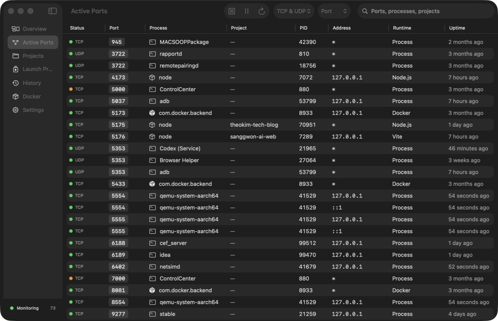

# DevBerth

[](https://github.com/ysbc1247/portpilot-macos/actions/workflows/ci.yml)

DevBerth is a native macOS developer utility for discovering, understanding, stopping, restarting, and organizing the local services behind occupied ports. It combines a dense real-time listener table with reliable, reviewed launch profiles, dependency-aware projects, Docker port mapping, local history, and a compact menu-bar experience.



## Highlights

- Discovers TCP listeners and meaningful UDP endpoints across IPv4, IPv6, loopback, local-network, and wildcard addresses.
- Shows PID, owner, executable, full command, start time, working directory, inferred project, runtime classification, address scope, and Docker association when verified locally.
- Separates discovered processes from reviewed launch profiles; inferred commands are never executed automatically.
- Gracefully stops a process with `SIGTERM`, waits for its configured timeout, and requires explicit confirmation before `SIGKILL`.
- Revalidates PID, executable path, and process start time immediately before every destructive process action.
- Supports generic commands, npm/pnpm/Yarn/Bun scripts, Gradle, Maven, executables, custom shells, Docker containers, and Docker Compose services.
- Starts project dependencies in ordered layers while parallelizing independent services and rejecting dependency cycles.
- Uses Keychain-backed secret references, bounded redacted logs, expected-port readiness, optional HTTP health checks, and preflight conflict resolution.
- Maps published Docker host ports to container ports, image, container, and Compose metadata; Docker absence never breaks listener monitoring.
- Persists projects, profiles, expected ports, dependencies, observations, favorites, settings, log metadata, and event history with SwiftData.
- Includes Overview, Active Ports, Projects, Launch Profiles, History, Docker, Settings, a `⌘K` command palette, and a menu-bar utility.
- Keeps all data on the Mac. DevBerth has no analytics, telemetry, cloud sync, or network upload path.

## Requirements

- macOS 14.0 or newer
- Xcode 16.4 or newer
- Swift 5 language mode (the current project is validated with Xcode 26.4 and Swift 6.3)
- Docker CLI only for optional container features

DevBerth is intentionally not App Sandbox-enabled because system-wide process discovery and signaling are core local features. Hardened Runtime remains enabled, normal usage does not require root, and DevBerth never installs a privileged helper.

## Build

```bash
git clone https://github.com/ysbc1247/portpilot-macos.git
cd portpilot-macos
DEVELOPER_DIR=/Applications/Xcode.app/Contents/Developer \
  xcodebuild -project DevBerth.xcodeproj -scheme DevBerth \
  -configuration Debug -destination 'platform=macOS,arch=arm64' \
  CODE_SIGNING_ALLOWED=NO build
```

Open `DevBerth.xcodeproj` in Xcode to run the signed development app. The committed project is generated from `project.yml`; install [XcodeGen](https://github.com/yonaskolb/XcodeGen) and run `xcodegen generate` after changing project structure.

## Test

```bash
DEVELOPER_DIR=/Applications/Xcode.app/Contents/Developer \
  xcodebuild -project DevBerth.xcodeproj -scheme DevBerth \
  -destination 'platform=macOS,arch=arm64' \
  CODE_SIGNING_ALLOWED=NO test
```

The suite uses mocks and parser fixtures for unit tests. Integration tests start only repository-owned Python listeners on temporary high ports and always terminate them in cleanup. No test sends a signal to an unrelated process.

For interactive UI verification:

```bash
Scripts/start_demo_fixtures.sh
# Explore ports 49151–49156 in DevBerth.
Scripts/stop_demo_fixtures.sh
```

Fixtures include a simple HTTP service, a process with two ports, an early-exit process, a process that ignores `SIGTERM`, a simulated conflict, and a delayed health endpoint. They are development-only.

## Architecture

DevBerth uses injected service protocols between SwiftUI state and every OS-facing boundary. Tagged `lsof` output discovers network files; `ps` and tagged `lsof` records enrich process identity. An actor-based monitor creates diff updates off the main actor. SwiftData stores durable configuration and audit events, while live process objects remain actor-isolated and transient. Keychain contains secret values; profiles contain only UUID references.

See [ARCHITECTURE.md](ARCHITECTURE.md) and [Documentation/ARCHITECTURE.md](Documentation/ARCHITECTURE.md) for the detailed runtime, persistence, concurrency, safety, and testing design.

## Privacy and security

Port, process, project, command, history, Docker, log, and preference data remain on the local Mac. Diagnostics exclude commands, environment values, and Keychain data. See [PRIVACY.md](PRIVACY.md) and [SECURITY.md](SECURITY.md).

## Current limitations

- macOS cannot reconstruct an arbitrary process's original shell session or complete environment. Exact restarts require a reviewed launch profile.
- Root-owned and recognized Apple/system processes are intentionally blocked from termination. DevBerth does not request elevation.
- Some process metadata may be unavailable because of ownership or macOS privacy restrictions; unavailable values stay visibly unavailable rather than inferred.
- UDP has no universal listening state, so DevBerth reports meaningful bound UDP endpoints instead of claiming TCP-style semantics.
- Project-marker inference checks only parent directories of a verified working directory; it never recursively scans the user’s filesystem.
- DevBerth currently supports one dependency selector per profile in the editor, while the domain planner and persistence schema already support arbitrary dependency graphs.
- This repository does not include Developer ID signing, notarization, or an update channel.

## Roadmap

- Multi-dependency editing and richer project graph visualization
- Signed/notarized distribution and Sparkle-free native update strategy evaluation
- Configurable per-profile log retention and richer persisted log indexing
- Additional process classifiers and Compose profile authoring helpers
- Dedicated UI automation coverage alongside the current accessibility/manual pass

## License

MIT. See [LICENSE](LICENSE).
