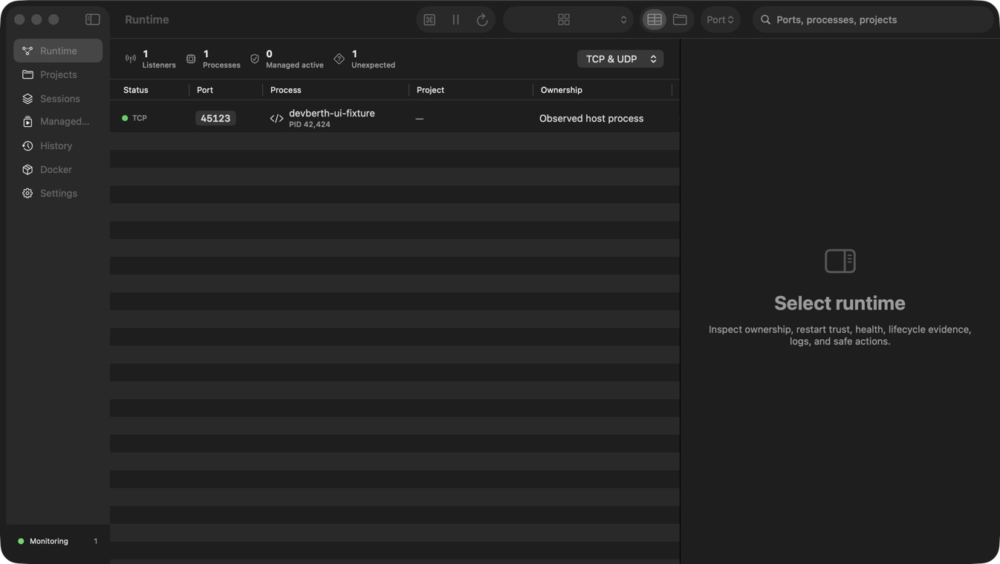

# DevBerth

[](https://github.com/ysbc1247/portpilot-macos/actions/workflows/ci.yml)

DevBerth is a native macOS runtime explainer and guarded service controller for local development. It correlates listeners, processes, ownership evidence, managed services, projects, sessions, lifecycle history, health, and exact Docker/Compose context without turning observation into authority.



DevBerth also exposes the same application-owned control plane to Codex and compatible MCP clients through the protocol-clean `devberth-mcp` STDIO helper. The helper connects to the running app over a current-user Unix socket; it does not scan processes, poll Docker, open the database, or read Keychain values itself.

## Highlights

- Discovers TCP listeners and meaningful UDP endpoints across IPv4, IPv6, loopback, local-network, and wildcard addresses.
- Shows PID, owner, executable, full command, start time, working directory, inferred project, runtime classification, address scope, and Docker association when verified locally.
- Separates observed processes from reviewed managed services; inferred or discovered commands are never executed automatically.
- Shows explicit restart trust and enables normal Start only after the exact reviewed configuration passes isolated start, readiness, and controlled-stop validation.
- Gracefully stops a process with `SIGTERM`, waits for its configured timeout, and requires explicit confirmation before `SIGKILL`.
- Revalidates PID, executable path, and process start time immediately before every destructive process action.
- Supports generic commands, npm/pnpm/Yarn/Bun scripts, Gradle, Maven, executables, custom shells, Docker containers, and Docker Compose services.
- Starts project dependencies in ordered layers while parallelizing independent services and rejecting dependency cycles.
- Captures selected projects as workspace sessions, compares saved state with the live runtime, previews every restore action and conflict, supports dry runs, and restores verified services with dependency-aware rollback.
- Discovers npm, pnpm, Yarn, Bun, Gradle, Maven, Python, Go, Cargo, Docker Compose, Procfile, and Process Compose definitions only inside an explicitly selected project root; imports remain unreviewed until validated.
- Imports and exports the versioned `devberth-runtime.json` manifest without secret values or Keychain reference identifiers.
- Uses transactional Keychain-backed secret references, bounded redacted logs, expected-port readiness, optional HTTP health checks, and preflight conflict resolution.
- Separates process, listener, readiness, and health state; supports reviewed HTTP text, command, file, Docker, and dependency checks with bounded retry behavior.
- Records a searchable lifecycle timeline, runtime instances, health transitions, unexpected exits, automatic-restart evidence, and deterministic incident summaries.
- Maps published Docker listeners to exact container ports, state, health, restart policy, and Compose metadata. Compose stop/restart/remove remains disabled until project files, environment context, configuration hash, and exact container membership are reverified; Docker absence never breaks listener monitoring.
- Persists projects, profiles, expected ports, dependencies, observations, favorites, settings, log metadata, and event history with SwiftData.
- Uses one native product hierarchy: Runtime, Projects, Sessions, Managed Services, History, Docker, and Settings. Runtime offers saved filters, table/project layouts, multi-selection, resource evidence, and a contextual inspector.
- Provides a keyboard-first `⌘K` command palette and compact menu-bar surface that route actions through the same ownership and restart-trust checks as the main window.
- Introduces the local-only safety model on first launch without requiring an account.
- Keeps all data on the Mac. DevBerth has no analytics, telemetry, cloud sync, or network upload path.

## Requirements

- macOS 14.0 or newer
- Xcode 16.4 or newer
- Swift 5 language mode (the current project is validated with Xcode 26.4 and Swift 6.3)
- Docker CLI only for optional container features

DevBerth is intentionally not App Sandbox-enabled because system-wide process discovery and signaling are core local features. Hardened Runtime remains enabled, normal usage does not require root, and DevBerth never installs a privileged helper.

## Build

```bash
git clone https://github.com/ysbc1247/portpilot-macos.git
cd portpilot-macos
DEVELOPER_DIR=/Applications/Xcode.app/Contents/Developer \
  xcodebuild -project DevBerth.xcodeproj -scheme DevBerth \
  -configuration Debug -destination 'platform=macOS,arch=arm64' \
  CODE_SIGNING_ALLOWED=NO build
```

Open `DevBerth.xcodeproj` in Xcode to run the signed development app. The committed project is generated from `project.yml`; install [XcodeGen](https://github.com/yonaskolb/XcodeGen) and run `xcodegen generate` after changing project structure.

## Codex and MCP

Open **DevBerth → Settings → Integrations → Codex & MCP**, install or repair the bundled helper, preview the global or project-scoped configuration, then apply it. The stable helper path is:

```text
~/Library/Application Support/DevBerth/bin/devberth-mcp
```

Equivalent Codex configuration:

```toml
[mcp_servers.devberth]
command = "/Users/YOU/Library/Application Support/DevBerth/bin/devberth-mcp"
args = ["serve", "--stdio"]
startup_timeout_sec = 10
tool_timeout_sec = 120
```

The Settings flow preserves unrelated TOML, rejects duplicate DevBerth tables and symlinks, previews the exact change, writes atomically, and keeps a timestamped backup. See [MCP overview](Documentation/MCP_OVERVIEW.md), [tool reference](Documentation/MCP_TOOL_REFERENCE.md), and [development mode](Documentation/MCP_DEVELOPMENT.md).

## Test

```bash
DEVELOPER_DIR=/Applications/Xcode.app/Contents/Developer \
  xcodebuild -project DevBerth.xcodeproj -scheme DevBerth \
  -destination 'platform=macOS,arch=arm64' \
  test
```

The full scheme uses Xcode’s local signing so the native UI-test runner can launch. For unit/integration-only CI, skip `DevBerthUITests` and set `CODE_SIGNING_ALLOWED=NO`. Every hosted test app uses an in-memory store, no production control socket, and empty or test-owned discovery. Integration and MCP acceptance tests start only bundled application-owned Python listeners on kernel-assigned ports and always terminate them in cleanup. UI tests use one static loopback-only runtime fixture. No test sends a signal to an unrelated process.

For repeated batching, retention, logging, Docker-transition, and harmless integration coverage, run `Scripts/run_soak_tests.sh`. See [Documentation/PERFORMANCE_AND_SOAK_TEST.md](Documentation/PERFORMANCE_AND_SOAK_TEST.md) for measured results and the extended-run release gate.

For interactive UI verification:

```bash
Scripts/start_demo_fixtures.sh
# Explore ports 49151–49156 in DevBerth.
Scripts/stop_demo_fixtures.sh
```

Fixtures include a simple HTTP service, a process with two ports, an early-exit process, a process that ignores `SIGTERM`, a simulated conflict, and a delayed health endpoint. They are development-only.

## Architecture

DevBerth uses injected service protocols between SwiftUI state and every OS-facing boundary. Tagged `lsof` output discovers network files; `ps` and tagged `lsof` records build a revalidated process fingerprint. Destructive actions require both that fingerprint and the exact listener ownership edge to still match. Reviewed services launch in dedicated POSIX process groups, track descendants, and exclude detached children from group signals. An actor-based monitor creates diff updates off the main actor. SwiftData stores durable configuration and audit events, while live process objects remain actor-isolated and transient. Keychain contains secret values; profiles contain only UUID references.

See [ARCHITECTURE.md](ARCHITECTURE.md), [Documentation/ARCHITECTURE.md](Documentation/ARCHITECTURE.md), and the [documentation index](Documentation/README.md) for the detailed runtime, persistence, concurrency, safety, and testing design. The product contract is summarized in [Documentation/PRODUCT_PRINCIPLES.md](Documentation/PRODUCT_PRINCIPLES.md), [Documentation/RUNTIME_OWNERSHIP.md](Documentation/RUNTIME_OWNERSHIP.md), and [Documentation/PRODUCT_SURFACE.md](Documentation/PRODUCT_SURFACE.md).

The workspace capture, preflight, restore, and rollback contract is documented in [Documentation/SESSION_MODEL.md](Documentation/SESSION_MODEL.md).

## Privacy and security

Port, process, project, command, history, Docker, log, and preference data remain on the local Mac. Diagnostics exclude commands, environment values, and Keychain data. See [PRIVACY.md](PRIVACY.md), [SECURITY.md](SECURITY.md), and the detailed [security threat model](Documentation/SECURITY_THREAT_MODEL.md).

## Current limitations

- macOS cannot reconstruct an arbitrary process's original shell session or complete environment. Exact restarts require a reviewed, successfully validated managed-service definition.
- Existing profiles migrate safely as conditional and require one successful validation before their first verified restart under Phase 2.
- Root-owned and recognized Apple/system processes are intentionally blocked from termination. DevBerth does not request elevation.
- Some process metadata may be unavailable because of ownership or macOS privacy restrictions; unavailable values stay visibly unavailable rather than inferred.
- UDP has no universal listening state, so DevBerth reports meaningful bound UDP endpoints instead of claiming TCP-style semantics.
- Project-marker inference checks only parent directories of a verified working directory; it never recursively scans the user’s filesystem.
- DevBerth currently supports one dependency selector per profile in the editor, while the domain planner and persistence schema already support arbitrary dependency graphs.
- This repository does not include Developer ID signing, notarization, or an update channel.

## Roadmap

- Multi-dependency editing and richer project graph visualization
- Signed/notarized distribution and Sparkle-free native update strategy evaluation
- Configurable per-profile log retention and richer persisted log indexing
- Additional process classifiers and Compose profile authoring helpers
- An eight-hour production-monitor soak before the first signed release

## License

MIT. See [LICENSE](LICENSE).
